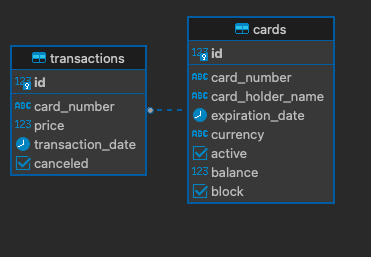

# Bank Inc Card Management API

Este proyecto es una API REST que permite gestionar tarjetas de débito o crédito para los clientes de Bank Inc. Proporciona varias funcionalidades, incluida la generación de números de tarjeta, activación de tarjetas y más.

# Modelo de Base de Datos para Bank Inc

Este documento describe el modelo de base de datos utilizado por Bank Inc para gestionar tarjetas y transacciones. El modelo consta de dos tablas principales: `cards` (tarjetas) y `transactions` (transacciones). Cada tabla se describe en detalle a continuación.

## Tabla `cards`

La tabla `cards` almacena información sobre las tarjetas emitidas por Bank Inc. Cada fila representa una tarjeta individual y contiene los siguientes campos:

- `id` (SERIAL): Identificador único de la tarjeta (clave primaria) generado automáticamente.
- `card_number` (VARCHAR(16)): Número de tarjeta de 16 dígitos (único y obligatorio). Se asegura de que cada tarjeta tenga un número único.
- `card_holder_name` (VARCHAR(255)): Nombre del titular de la tarjeta (obligatorio).
- `expiration_date` (DATE): Fecha de vencimiento de la tarjeta (obligatoria en formato MM/AAAA).
- `currency` (VARCHAR(3)): Moneda de la tarjeta (obligatoria, por ejemplo, USD para dólares).
- `active` (BOOLEAN): Estado de activación de la tarjeta (obligatorio, true si está activa, false si está inactiva).
- `balance` (DOUBLE PRECISION): Saldo actual en la tarjeta (obligatorio, con precisión de doble precisión).
- `block` (BOOLEAN): Estado de bloqueo de la tarjeta (obligatorio, true si está bloqueada, false si no lo está).

**Notas adicionales:**

- El campo `card_number` es único para cada tarjeta y se utiliza como identificador principal.
- La columna `balance` se almacena con precisión de doble precisión para evitar errores de redondeo en cálculos financieros.

## Tabla `transactions`

La tabla `transactions` registra todas las transacciones realizadas con las tarjetas emitidas por Bank Inc. Cada fila representa una transacción individual y contiene los siguientes campos:

- `id` (SERIAL): Identificador único de la transacción (clave primaria) generado automáticamente.
- `card_number` (VARCHAR(16)): Número de tarjeta asociado a la transacción (obligatorio y se relaciona con la tabla `cards`).
- `price` (DOUBLE PRECISION): Monto de la transacción (obligatorio, con precisión de doble precisión).
- `transaction_date` (TIMESTAMP): Fecha y hora de la transacción (obligatoria).
- `canceled` (BOOLEAN): Estado de cancelación de la transacción (obligatorio, valor predeterminado es false).

**Notas adicionales:**

- El campo `card_number` en la tabla `transactions` se utiliza como clave externa que se relaciona con la columna `card_number` de la tabla `cards`.
- La columna `canceled` indica si la transacción ha sido cancelada o no.

Este modelo de base de datos proporciona una estructura sólida para gestionar tarjetas y transacciones en el sistema de Bank Inc. Los índices y restricciones de clave externa deben ser implementados según sea necesario para garantizar la integridad y eficiencia de los datos.

Es importante adaptar este modelo a la base de datos específica que se esté utilizando y a los requisitos exactos de la aplicación.




# Endpoints

La app se desplego en AWS con el servicio Elastic Beanstalk, tambien se creo la base de datos postgresql en aws, para probar puede usar POSTMAN y usar los endpoints

API : http://api-cards-env.eba-ufg3rjqa.us-east-1.elasticbeanstalk.com/
### 1. Generar número de tarjeta

- **Método**: GET
- **Recurso**: `/card/{productId}/number`
- **Descripción**: Este endpoint permite generar un número de tarjeta único a partir del ID del producto.
- **Parámetros de entrada**: `productId` (ID del producto)
- **Ejemplo de solicitud**:
  ```http
  GET /card/123456/number

  {
    "message": "Número de tarjeta generado exitosamente",
    "code": 200,
    "data": {
      "cardId": "1234567890123456",
      "cardHolderName": "John Doe",
      "expirationDate": "2026-09-02",
      "currency": "USD",
      "active": false,
      "balance": 0.0,
      "blocked": false
    }
  }


### 2. Activar Tarjeta
- **Método**: POST
- **Recurso**: `/card/enroll`
- **Descripción**: Activa una tarjeta bancaria en el sistema.
- **Ejemplo de solicitud**:
```http
POST /card/enroll

{
    "cardId": "1020301234567801"

}

```
### 3. Bloquear Tarjeta
- **Método**: DELETE
- **Recurso**: `/card/{cardId}`
- **Descripción**: Bloquea una tarjeta bancaria en el sistema..
- **Ejemplo de solicitud**:
```http
DELETE /card/1020301234567801

```
### 4. Agregar Saldo
- **Método**: POST
- **Recurso**: `/card/balance`
- **Descripción**: Agrega saldo a una tarjeta bancaria existente.
- **Ejemplo de solicitud**:
```http
POST /card/balance

{
    "cardId": "1020301234567801",
    "balance": 10000
}
```
### 5. Consulta Saldo
- **Método**: GET
- **Recurso**: `/card/balance/{cardId}`
- **Descripción**: Consulta el saldo actual de una tarjeta bancaria.
- **Ejemplo de solicitud**:
```http
GET /card/balance/1020301234567801

```
### 6. Transacción de Compra
- **Método**: GET
- **Recurso**: `/transaction/purchase`
- **Descripción**: Realiza una transacción de compra utilizando una tarjeta bancaria.
- **Ejemplo de solicitud**:
```http
POST /transaction/purchase
{
    "cardId": "1020301234567801",
    "price": 100
}

```
### 7. Obtener detalles de una transacción
- **Método:** GET
- **Ruta:** `/transaction/{transactionId}`
- **Descripción:** Esta ruta permite obtener detalles de una transacción específica mediante su ID.
```http
GET /transaction/1

```

### 8. Anular una transacción
- **Método:** POST
- **Ruta:** `/transaction/anulation`
- **Descripción:** Esta ruta permite anular una transacción previamente realizada proporcionando el numero de la tarjeta y el ID de la transacción que se desea anular en el cuerpo de la solicitud.
```http
POST /transaction/anulation
{
  "cardId": "1020301234567801",
  "transactionId": "54321"
}

